# 系统结构设计文档编写流程图

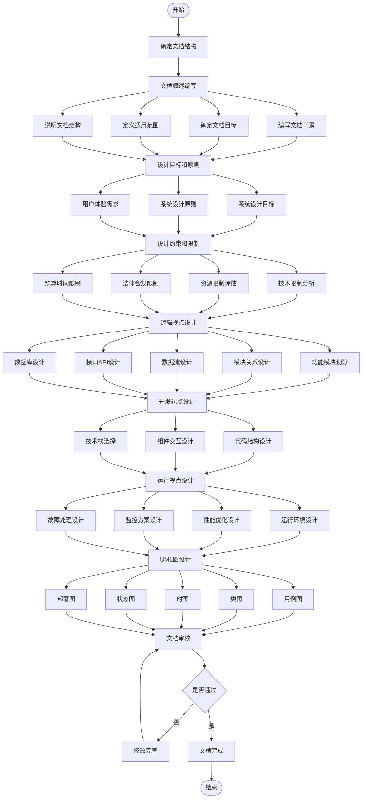

# 系统部署图

## 1. 基础部署架构
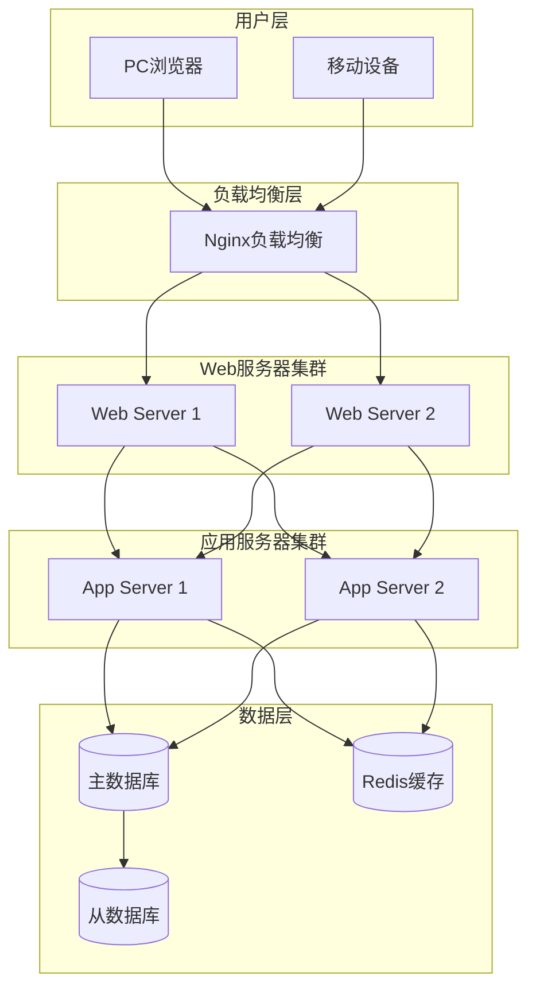

## 2. 网络拓扑部署图
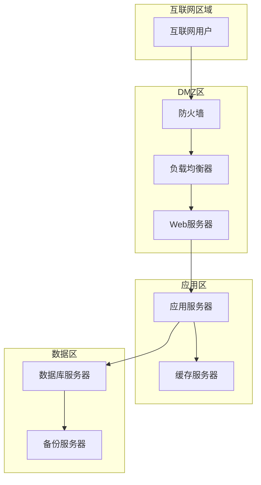

## 3. 高可用部署架构
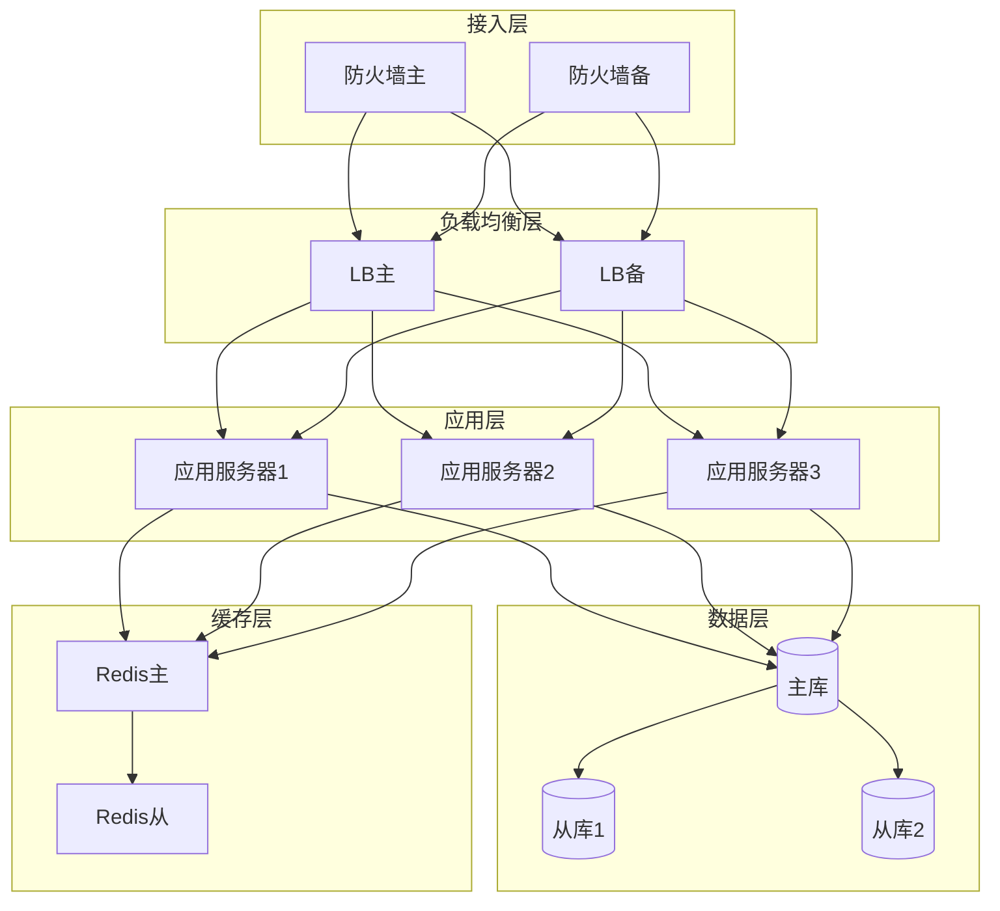

## 4. 监控系统部署图
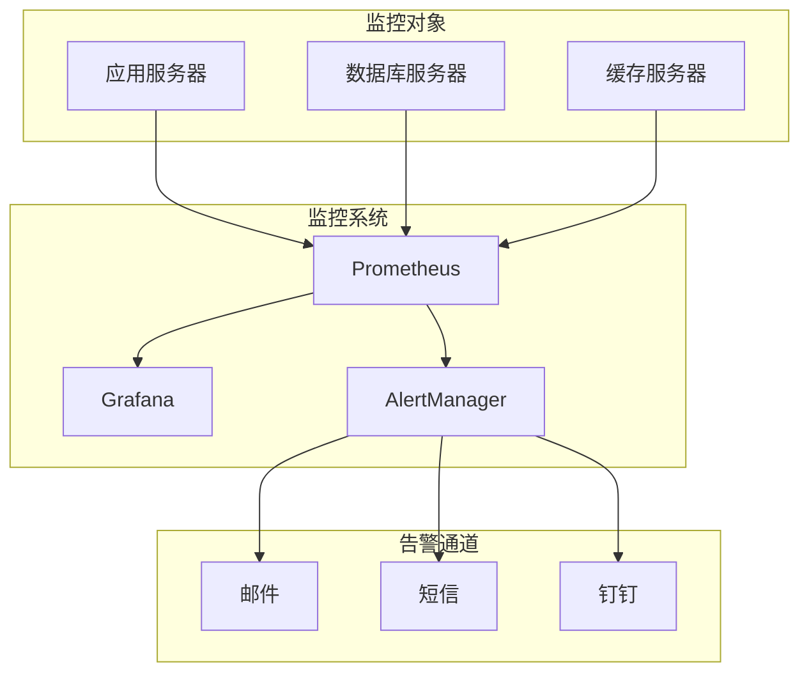

# 系统整体体系架构图

## 1. 系统分层架构
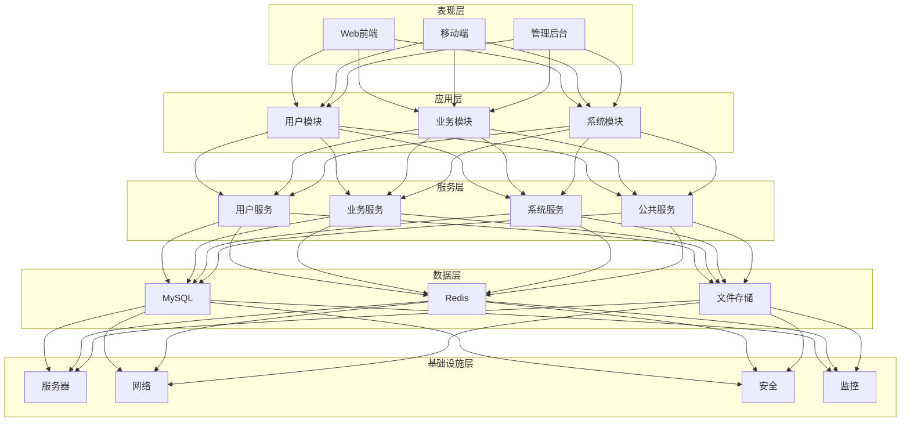

## 2. 系统功能架构
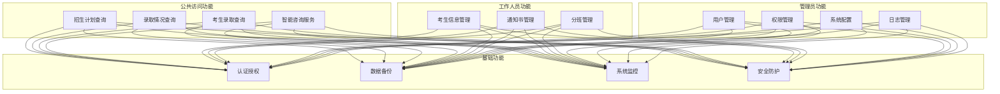

## 3. 技术架构
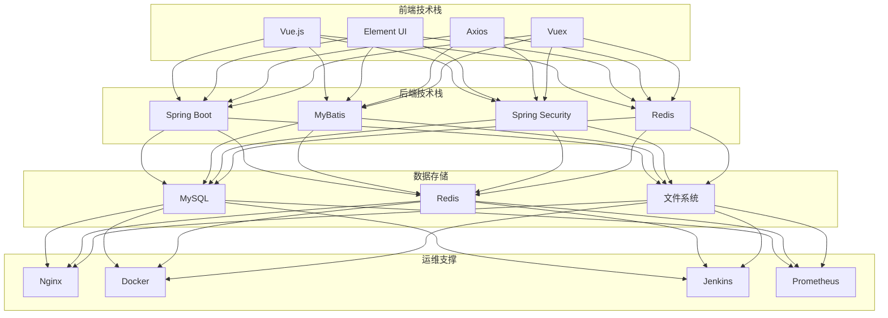

## 4. 安全架构
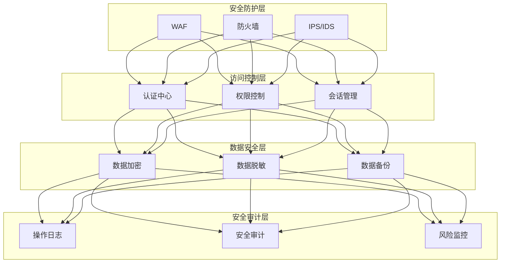

## 5. 系统分层详细架构
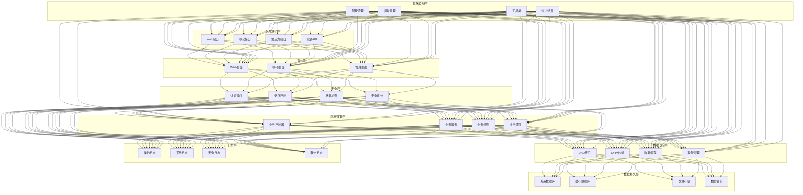

## 6. 数据访问层详细架构
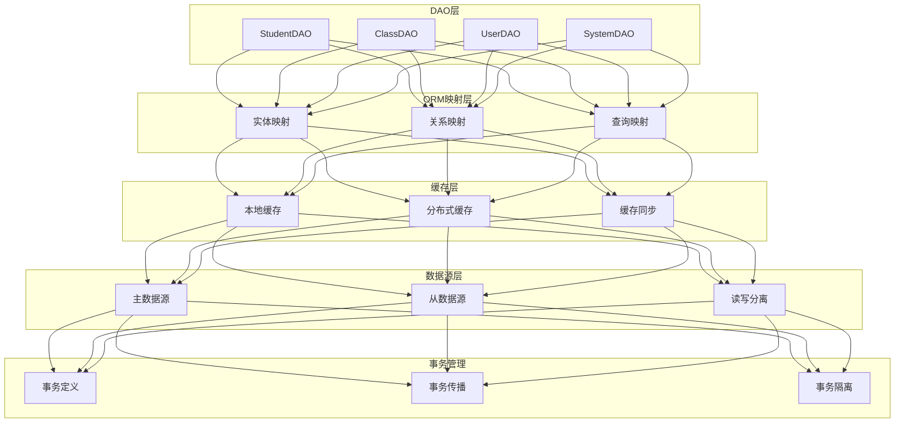

## 7. 清晰的系统分层架构
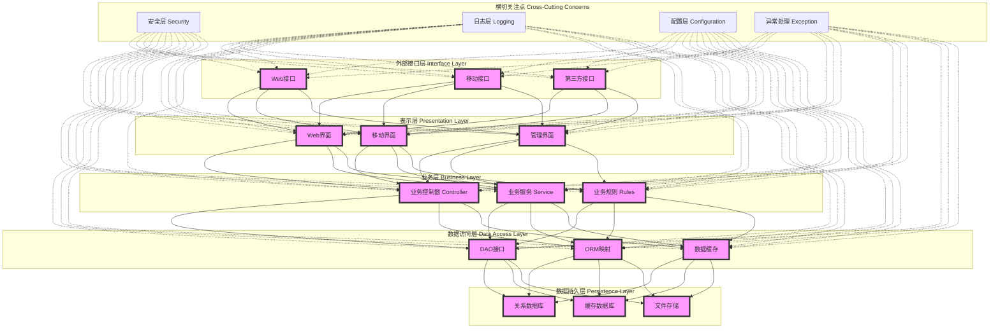

主要特点：
1. 清晰的层次结构：
   - 外部接口层：处理所有外部请求
   - 表示层：负责用户界面展示
   - 业务层：处理核心业务逻辑
   - 数据访问层：提供数据操作接口
   - 数据持久层：实现数据持久化

2. 横切关注点：
   - 安全层：权限控制、认证授权
   - 日志层：系统日志、操作日志
   - 配置层：系统配置管理
   - 异常处理：统一异常处理

3. 层次间通信：
   - 实线表示直接依赖
   - 虚线表示横切关注点的影响范围

4. 每层职责明确：
   - 单一职责原则
   - 高内聚低耦合
   - 接口隔离
   - 依赖倒置

## 8. 优化后的系统分层架构
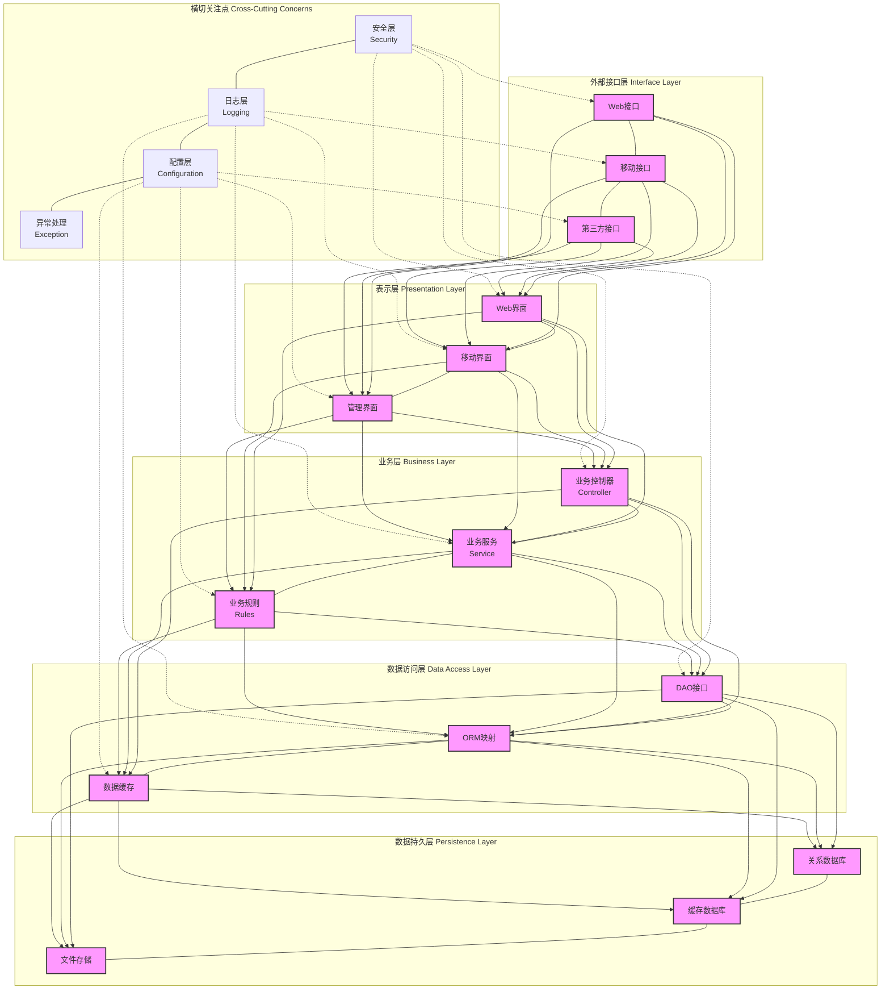

主要改进：
1. 每个子图内部采用竖向排列
2. 减少横向连接线
3. 增加文字间距
4. 使用 实现文字换行
5. 简化横切关注点的连接线
6. 调整节点大小和间距

这样的布局更加清晰，文字更容易阅读，层次关系更加明显。如果您觉得还需要进一步调整，我可以继续优化。
