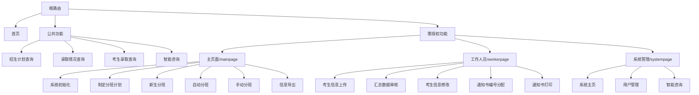

# 哈尔滨师范大学招生录取系统结构设计文档

## 1. 文档概述

### 1.1 文档背景
随着高等教育的发展和信息化建设的推进，哈尔滨师范大学需要一个现代化的招生录取管理系统，以提升招生工作效率，为考生提供便捷的信息查询服务。本系统旨在实现招生计划查询、录取信息管理、新生分班等功能的信息化和自动化。

### 1.2 文档目标
- 明确系统的整体架构和技术路线
- 定义系统的功能模块和业务流程
- 规范系统的开发标准和接口规范
- 指导系统的开发、测试和维护工作
- 为系统后期扩展提供技术支持

### 1.3 适用范围
本文档适用于以下对象：
- 系统开发人员：指导系统的设计和实现
- 测试人员：了解系统功能和测试要点
- 运维人员：系统部署和维护参考
- 项目管理人员：项目进度和质量控制
- 学校相关部门：了解系统功能和使用方式

### 1.4 文档结构
本文档包含以下主要部分：
1. 文档概述：介绍文档背景、目标和适用范围
2. 系统架构：详述技术架构和模分
3. 数据流程：描述系统数据处理流程
4. 安全设计：说明系统安全机制
5. 部署架构：规划系统部署方案
6. 扩展性设计：系统扩展性考虑
7. 开发视点体系结构设计：系统开发视点体系结构设计

### 1.5 系统功能描述
1. 信息查询功能
   - 历年招生计划查询：支持按年份、专业等多维度查询
   - 历年录取情况查询：提供历年录取分数线、录取人数等信息
   - 当年录取考生查询：支持考生个人录取信息查询
   - 智能咨询服务：提供智能问答功能，解答考生常见问题

2. 考生信息管理
   - 录取信息导入：支持CSV、DBF等格式文件批量导入
   - 信息审核：录取数据的准确性验证
   - 信息修改：支持考生信息的修改和更新
   - 通知书管理：通知书编号分配和打印

3. 分班管理功能
   - 分班计划制定：设置分班规则和条件
   - 自动分班：根据预设规则自动完成分班
   - 手动分班调整：支持人工干预调整
   - 分班结果查看：多维度查看分班结果
   - 数据导出：支持分班结果的导出

4. 系统管理功能
   - 用户管理：管理员账号的创建和权限分配
   - 系统监控：系统运行状态监控
   - 日志管理：记录系统操作日志

### 1.6 系统主要特性
1. 高可用性
   - 支持多用户并发访问
   - 系统响应时间快
   - 数据实时更新
   - 操作界面友好

2. 安全性
   - 多级权限控制
   - 数据加密传输
   - 操作日志记录
   - 防SQL注入和XSS攻击

3. 可扩展性
   - 模块化设计
   - 支持功能扩展
   - 接口标准化
   - 数据库可扩展

4. 智能化
   - 智能分班算法
   - AI智能问答
   - 数据智能分析
   - 自动化处理

### 1.7 系统运行环境

1. 硬件环境
   - 服务器配置
     * CPU：Intel Xeon E5-2680 v4 或更高
     * 内存：16GB 或更高
     * 硬盘：500GB SSD
     * 网络：千兆网络接入
   
   - 客户端配置
     * CPU：Intel Core i3 或更高
     * 内存：4GB 或更高
     * 网络：支持网络访问
     * 显示器：1920×1080 分辨率或更高

2. 软件环境
   - 服务器端
     * 操作系统：CentOS 7.x 或 Ubuntu 20.04 LTS
     * 数据库：MySQL 8.0
     * JDK：Version 11 或更高
     * Node.js：Version 14.x 或更高
   
   - 客户端
     * 操作系统：Windows 7/10/11, macOS, Linux
     * 浏览器：Chrome 80+, Firefox 75+, Edge 80+
     * PDF阅读器：用于查看导出文档

3. 网络环境
   - 内网带宽：≥100Mbps
   - 外网带宽：≥50Mbps
   - 支持HTTPS安全传输协议

### 1.8 用户需求概述

1. 考生需求
   - 快速查询个人录取信息
   - 获取历年招生数据
   - 便捷的智能咨询服务
   - 清晰的信息展示界面
   - 手机端适配支持

2. 招生工作人员需求
   - 批量导入考生数据
   - 便捷的数据审核功能
   - 灵活的信息修改功能
   - 通知书打印管理
   - 数据统计分析功能

3. 教务人员需求
   - 灵活的分班规则设置
   - 自动化分班功能
   - 便捷的手动调班功能
   - 分班结果导出功能
   - 数据可视化展示

4. 系统管理员需求
   - 完善的用户权限管理
   - 系统运行状态监控
   - 数据备份恢复功能
   - 系统日志查询
   - 系统参数配置

## 2. 系统架构

### 2.1 技术架构
- 前端：Vue.js + Vue Router + Element UI
- 后端：Spring Boot + MyBatis
- 数据库：MySQL
- 开发工具：IDEA、VS Code
- 版本控制：Git

### 2.2 系统模块划分

#### 2.2.1 前端模块
1. 公共访问模块
   - 首页（HomePage）
   - 历年招生计划查询（SearchPlan）
   - 历年录取情况查询（SearchEnroll）
   - 当年录取考生查询（EnrollPage）
   - 智能咨询助手（ChatPage）

2. 管理员模块
   - 系统管理（SystemPage）
     - 系统主页（SystemMain）
     - 用户管理（ManageUser）
   
3. 工作人员模块（WorkerPage）
   - 考生信息管理
     - 录取考生信息上传（WorkerCheckStu）
     - 录取汇总数据审核（WorkerCheckSumData）
     - 考生信息修改（WorkerChangeStuMsg）
   - 通知书管理
     - 通知书编号分配（WorkerPrint）
     - 通知书打印（WorkerPrintPaper）

4. 分班管理模块（MainPage）
   - 系统初始化（SystemInitialize）
   - 分班计划制定（MakePlan）
   - 新生分班（StuBanding）
   - 自动分班（AutomaticShift）
   - 手动分班（ManualShift）
   - 信息导出（InformationExport）
   - 分班查看（ShiftView）
   - 统计分析（WebAnalysis）

#### 2.2.2 后端模块
1. 用户认证与授权
   - 登录验证
   - 权限控制
   - Token管理

2. 数据管理
   - 招生计划管理
   - 录取信息管理
   - 分班信息管理
   - 用户信息管理

3. 业务逻辑
   - 分班算法
   - 数据统计
   - 信息导出

4. 系统服务
   - 文件上传下载
   - 日志管理
   - 系统监控

## 3. 数据流程

### 3.1 用户访问流程
1. 普通用户
   - 无需登录即可访问首页和各类查询功能
   - 可使用智能咨询助手进行问答

2. 管理员/工作人员
   - 需要登录验证
   - 根据权限访问相应功能模块
   - 所有操作记录日志

### 3.2 数据处理流程
1. 数据录入
   - 文件上传（CSV、DBF等格式）
   - 表单提交
   - 数据验证

2. 数据存储
   - 数据库持久化
   - 缓存处理

3. 数据输出
   - 查询结果展示
   - 报表导出
   - 打印输出

## 4. 安全设计

1. 用户认证
   - 基于Token的身份验证
   - Cookie管理
   - 会话控制

2. 权限控制
   - 路由级别权限控制
   - 功能级别权限控制
   - API访问控制

3. 数据安全
   - 敏感数据加密
   - SQL注入防护
   - XSS防护

## 5. 部署架构

1. 开发环境
   - 前端开发服务器
   - 后端开发服务器
   - 测试数据库

2. 生产环境
   - Web服务器
   - 应用服务器
   - 生产数据库
   - 负载均衡（可选）

## 6. 扩展性设计

1. 模块化设计
   - 组件复用
   - 功能模块独立

2. 接口设计
   - RESTful API
   - 统一响应格式
   - 版本控制

3. 可配置性
   - 系统参数配置
   - 业务规则配置

## 7. 附录

### 7.1 术语表
- RESTful API：表述性状态传递应用程序接口
- Token：访问令牌，用于身份验证
- XSS：跨站脚本攻击
- SQL注入：数据库攻击方式
- Vue.js：前端JavaScript框架
- Spring Boot：后端Java框架

### 7.2 参考
- Vue.js官方文档
- Spring Boot官方文档
- Element UI组件库文档
- MySQL数据库文档

### 7.3 版本历史
| 版本号 | 修改日期 | 修改人 | 修改内容 |
|--------|----------|--------|----------|
| v1.0.0 | 2024-03-xx | 系统设计组 | 初始版本 |

### 7.4 联系方式
- 技术支持：[技术支持联系方式]
- 系统管理员：[系统管理员联系方式]
- 招生办公室：[招生办公室联系方式]

## 2. 设计目标和原则

### 2.1 系统设计目标

1. 功能目标
   - 实现招生信息全流程管理
   - 提供便捷的信息查询服务
   - 支持智能化的考生咨询
   - 实现自动化的新生分班
   - 确保数据的准确性和安全性

2. 性能目标
   - 系统响应时间：页面加载 < 2秒
   - 并发用户数：支持500+用户同时在线
   - 数据处理能力：批量导入1万条数据 < 1分钟
   - 系统可用性：99.9%运行时间

3. 安全目标
   - 确保考生信息安全
   - 防止未授权访问
   - 保护系统免受攻击
   - 保证数据完整性

4. 可维护性目标
   - 系统易于部署和维护
   - 支持模块独立升级
   - 具备完善的监控机制
   - 提供详细的系统文档

### 2.2 系统设计原则

1. 开放性原则
   - 采用开放标准和协议
   - 提供标准化接口
   - 支持第三方系统集成
   - 保证系统可扩展性

2. 安全性原则
   - 最小权限原则
   - 纵深防御策略
   - 数据加密传输
   - 完整的审计机制

3. 可靠性原则
   - 数据实时备份
   - 故障快速恢复
   - 系统状态监控
   - 异常处理机制

4. 易用性原则
   - 界面简洁直观
   - 操作流程清晰
   - 响应及时准确
   - 提供操作指引

5. 可维护性原则
   - 模块化设计
   - 代码规范统一
   - 充分的注释说明
   - 完善的文档支持

6. 经济性原则
   - 合理利用资源
   - 优化系统性能
   - 降低维护成本
   - 提高投资回报

### 2.3 用户体验需求

1. 界面设计需求
   - 符合学校视觉风格
   - 布局清晰合理
   - 操作简单直观
   - 适配多种设备
   - 支持深色模式（可选）

2. 交互设计需求
   - 即时响应用户操作
   - 提供操作反馈
   - 支持快捷键操作
   - 表单智能填充
   - 数据实时验证

3. 性能体验需求
   - 页面快速加载
   - 操作流畅无卡顿
   - 数据实时更新
   - 支持断点续传
   - 离线功能支持

4. 帮助支持需求
   - 智能问答服务
   - 操作引导提示
   - 在线帮助文档
   - 错误提示友好
   - 问题快速反馈

5. 个性化需求
   - 自定义界面布局
   - 个人偏好设置
   - 常用功能快捷访问
   - 历史记录查看
   - 数据导出格式选择

6. 无障碍需求
   - 支持键盘操作
   - 文字大小可调
   - 对比度适配
   - 语音辅助（可选）
   - 特殊群体适配

## 3. 设计约束和现实限制

### 3.1 技术限制

1. 前端技术限制
   - Vue.js框架版本限制：需使用Vue 3.x版本
   - 浏览器兼容性要求：仅支持现代浏览器
   - 移动端适配限制：优先支持主流移动设备
   - UI组件库限制：基于Element UI组件库开发

2. 后端技术限制
   - Java版本要求：JDK 11或更高版本
   - Spring Boot版本：2.x系列
   - 数据库版本：MySQL 8.0
   - 服务器系统：仅支持Linux系统部署

3. 性能限制
   - 并发处理能力：最大支持1000用户同时在线
   - 数据处理量：单次导入限制100MB以内
   - 响应时间：复杂查询最长响应时间不超过5秒
   - 存储容量：单个文件上传限制50MB

4. 接口限制
   - API调用频率限制：每秒最多100次请求
   - 数据传输格式：仅支持JSON格式
   - 接口版本控制：最多支持前三个版本
   - 第三方集成限制：仅支持指定的认证接口

### 3.2 资源限制

1. 硬件资源限制
   - 服务器配置上限：4核CPU、16GB内存
   - 存储空间限制：初期配置500GB存储空间
   - 带宽限制：100Mbps带宽
   - 备份设备限制：1TB备份存储空间

2. 软件资源限制
   - 商用软件许可：受限于预算的软件授权数量
   - 开发工具限制：社区版IDE使用限制
   - 第三方服务限制：免费API调用次数限制
   - 测试环境资源：仅提供基础测试环境

3. 人力资源限制
   - 开发团队规模：3-5人开发团队
   - 技术支持人员：1-2名运维人员
   - 培训资源：每年培训预算有限
   - 外部专家咨询：限定咨询次数和时长

### 3.3 法律和合规限制

1. 数据安全要求
   - 个人信息保护：符合《个人信息保护法》要求
   - 数据存储位置：必须存储在境内服务器
   - 数据保存期限：按规定期限保存和销毁数据
   - 数据加密要求：敏感信息必须加密存储

2. 系统合规要求
   - 高校信息系统安全等级保护要求
   - 教育部信息化建设标准
   - 网络安全法规要求
   - 软件著权规范

3. 隐私保护要求
   - 用户授权和同意要求
   - 信息收集最小化原则
   - 用户数据导出限制
   - 日志记录合规要求

4. 行业规范要求
   - 高校招生信息公开规范
   - 教育部门数据标准
   - 信息系统互联互通规范
   - 高校信息化建设规范

### 3.4 预算和时间限制

1. 预算限制
   - 开发成本：总预算50万元以内
   - 硬件投入：服务器和设备投入15万元以内
   - 运维成本：年度运维预算10万元
   - 培训费用：培训预算5万元/年

2. 时间限制
   - 开发周期：6个月完成主要功能开发
   - 测试时间：2个月系统测试时间
   - 部署时间：需在新学期开始前完成部署
   - 迭代周期：每两周一次迭代更新

3. 维护限制
   - 系统升级：每年最多2次大版本更新
   - 故障响应：工作时间2小时内响应
   - 备份时间：每日凌晨2-4点进行备份
   - 停机维护：每月最多4小时计划内停机

4. 验收限制
   - 功能验收：分阶段验收，每阶段不超过2周
   - 性能测试：需完成全部性能指标测试
   - 安全测试：必须通过等级保护测评
   - 试运行期：至少1个月试运行期

## 4. 逻辑视点体系结构设计

### 4.1 系统功能模块划分

1. 用户访问模块
   - 公共查询模块
     * 招生计划查询
     * 录取情况查询
     * 考生录取查询
     * 智能咨询服务
   - 用户认证模块
     * 登录认证
     * 权限验证
     * 会话管理

2. 考生信息管理模块
   - 数据导入模块
     * CSV文件导入
     * DBF文件导入
     * 数据验证处理
   - 信息维护模块
     * 考生信息修改
     * 数据审核确认
     * 信息导出打印

3. 分班管理模块
   - 分班规则模块
     * 规则配置管理
     * 分班计划制定
     * 规则验证检查
   - 分班执行模块
     * 自动分班处理
     * 手动分班调整
     * 分班结果验证
   - 结果管理模块
     * 分班结果查看
     * 统计分析处理
     * 数据导出功能

4. 系统管理模块
   - 用户管理模块
     * 用户账号管理
     * 角色权限管理
     * 操作日志记录
   - 系统配置模块
     * 参数配置管理
     * 系统初始化
     * 数据备份恢复

### 4.2 模块间关系

1. 模块依赖关系
   - 用户访问模块 → 用户认证模块
   - 考生信息管理模块 → 用户认证模块
   - 分班管理模块 → 考生信息管理模块
   - 系统管理模块 → 所有其他模块

2. 模块通信关系
   - 前端组件间通信：Vue Router, Vuex
   - 前后端通信：RESTful API
   - 后端服务间通信：Spring事件机制

3. 模块调用关系
   ```mermaid
   graph TD
   A[用户访问模块] --> B[用户认证模块]
   B --> C[考生信息管理模块]
   C --> D[分班管理模块]
   E[系统管理模块] --> B
   E --> C
   E --> D
   ```

### 4.3 数据流与控制流

1. 主要数据流向
   - 考生信息流
     ```mermaid
     graph LR
     A[文件上传] --> B[数据验证]
     B --> C[数据存储]
     C --> D[信息查询]
     C --> E[分班处理]
     E --> F[结果导出]
     ```

   - 用户操作流
     ```mermaid
     graph LR
     A[用户请求] --> B[权限验证]
     B --> C[业务处理]
     C --> D[数据响应]
     D --> E[结果展示]
     ```

2. 控制流程
   - 用户认证流程
   - 数据处理流程
   - 分班执行流程
   - 系统管理流程

### 4.4 数据结构与模型

1. 核心数据实体
   ```java
   // 考生信息实体
   class Student {
       Long id;                 // 学号
       String name;            // 姓名
       String idNumber;        // 身份证号
       Integer score;          // 分数
       String major;           // 专业
       String className;       // 班级
       // ... 其他字段
   }
   
   // 分班规则实体
   class ClassRule {
       Long id;                // 规则ID
       String ruleName;        // 规则名称
       String ruleType;        // 规则类型
       String ruleContent;     // 规则内容
       Integer priority;       // 优先级
       // ... 其他字段
   }
   ```

2. 数据传输对象
   ```java
   // 分班结果DTO
   class ClassAssignmentDTO {
       String className;       // 班级名称
       Integer studentCount;   // 学生数量
       List<Student> students; // 学生列表
       // ... 其他字段
   }
   ```

### 4.5 模块接口与API设计

1. RESTful API设计
   ```
   // 考生信息管理API
   GET    /api/students          // 获取考生列表
   POST   /api/students          // 创建考生信息
   PUT    /api/students/{id}     // 更新考生信息
   DELETE /api/students/{id}     // 删除考生信息
   
   // 分班管理API
   GET    /api/classes           // 获取班级列表
   POST   /api/classes/assign    // 执行分班
   PUT    /api/classes/{id}      // 更新班级信息
   GET    /api/classes/stats     // 获取分班统计
   ```

2. 内部接口设计
   ```java
   // 分班服务接口
   interface ClassAssignmentService {
       void assignClasses();              // 执行分班
       void adjustAssignment(Long stuId); // 调整分班
       List<ClassDTO> getClassStats();    // 获取统计
   }
   ```

### 4.6 数据库设计

1. 核心数据表
   ```sql
   -- 考生信息表
   CREATE TABLE t_student (
       id BIGINT PRIMARY KEY,
       name VARCHAR(50) NOT NULL,
       id_number VARCHAR(18) UNIQUE,
       score INT,
       major VARCHAR(100),
       class_name VARCHAR(50),
       create_time DATETIME,
       update_time DATETIME
   );
   
   -- 分班规则表
   CREATE TABLE t_class_rule (
       id BIGINT PRIMARY KEY,
       rule_name VARCHAR(100),
       rule_type VARCHAR(50),
       rule_content TEXT,
       priority INT,
       status TINYINT,
       create_time DATETIME,
       update_time DATETIME
   );
   
   -- 班级信息表
   CREATE TABLE t_class (
       id BIGINT PRIMARY KEY,
       class_name VARCHAR(50) UNIQUE,
       major VARCHAR(100),
       student_count INT,
       create_time DATETIME,
       update_time DATETIME
   );
   ```

2. 关系模型
   ```mermaid
   erDiagram
   STUDENT ||--o{ CLASS : belongs_to
   CLASS ||--|{ CLASS_RULE : follows
   STUDENT {
       bigint id PK
       string name
       string id_number
       int score
       string major
       string class_name
   }
   CLASS {
       bigint id PK
       string class_name
       string major
       int student_count
   }
   CLASS_RULE {
       bigint id PK
       string rule_name
       string rule_type
       text rule_content
       int priority
   }
   ```

3. 索引设计
   ```sql
   -- 考生信息索引
   CREATE INDEX idx_student_name ON t_student(name);
   CREATE INDEX idx_student_score ON t_student(score);
   CREATE INDEX idx_student_class ON t_student(class_name);
   
   -- 分班规则索引
   CREATE INDEX idx_rule_type ON t_class_rule(rule_type);
   CREATE INDEX idx_rule_priority ON t_class_rule(priority);
   ```

## 5. 部署视点体系结构设计

### 5.1 硬件布局

1. 服务器配置
   - 应用服务器
     * 型号：Dell PowerEdge R740
     * CPU：2 × Intel Xeon Gold 6248R
     * 内存：64GB DDR4
     * 系统盘：2 × 480GB SSD RAID1
     * 数据盘：4 × 1.8TB SAS HDD RAID10
   
   - 数据库服务器
     * 型号：Dell PowerEdge R740
     * CPU：2 × Intel Xeon Gold 6248R
     * 内存：128GB DDR4
     * 系统盘：2 × 480GB SSD RAID1
     * 数据盘：6 × 1.8TB SAS HDD RAID10

2. 存储设备
   - 备份存储
     * 型号：Synology RS1619xs+
     * 容量：4 × 4TB NAS HDD
     * RAID配置：RAID5
     * 网络：2 × 10GbE

3. 网络设备
   - 核心交换机
     * 型号：Cisco Catalyst 9300
     * 端口：24 × 10GbE
     * 特性：支持VLAN、QoS
   
   - 防火墙
     * 型号：Palo Alto PA-3260
     * 吞吐量：4Gbps
     * 特性：应用识别、威胁防护

### 5.2 软件环境

1. 操作系统
   - 应用服务器
     * OS：Ubuntu Server 20.04 LTS
     * 内核版本：5.4 LTS
     * 文件系统：ext4
     * 系统服务：SSH、NTP

   - 数据库服务器
     * OS：Ubuntu Server 20.04 LTS
     * 内核优化：MySQL性能调优
     * 系统服务：MySQL 8.0

2. 中间件
   - Web服务器
     * Nginx 1.18
     * 配置：反向代理、负载均衡
     * SSL证书：Let's Encrypt

   - 应用服务器
     * JDK 11
     * Spring Boot 2.6
     * Node.js 14.x

3. 监控工具
   - 系统监控：Prometheus + Grafana
   - 日志管理：ELK Stack
   - 应用监控：Spring Boot Admin

### 5.3 组件分布

1. 前端组件
   ```mermaid
   graph TD
   A[Nginx] --> B[Vue前端静态资源]
   A --> C[API网关]
   C --> D[后端服务]
   ```

   - 静态资源部署
     * /usr/share/nginx/html/
     * CDN加速（可选）
     * 资源压缩
   
   - 路由配置
     * 前端路由：Vue Router
     * API路由：Nginx反向代理

2. 后端组件
   ```mermaid
   graph TD
   A[API网关] --> B[认证服务]
   A --> C[业务服务]
   C --> D[数据库]
   C --> E[缓存]
   ```

   - 服务部署
     * /opt/app/
     * 服务注册
     * 配置中心

3. 数据库组件
   - 主库部署
     * 数据目录：/var/lib/mysql
     * 配置文件：/etc/mysql
     * 日志目录：/var/log/mysql

   - 备份部署
     * 备份目录：/backup/mysql
     * 备份策略：增量+全量
     * 恢复流程

### 5.4 网络拓扑

1. 网络架构
   ```mermaid
   graph TD
   A[互联网] --> B[防火墙]
   B --> C[DMZ区]
   C --> D[Web服务器]
   D --> E[应用服务器]
   E --> F[数据库服务器]
   ```

2. 网络分区
   - DMZ区
     * Web服务器
     * 负载均衡器
     * 防火墙内网口
   
   - 应用区
     * 应用服务器集群
     * 缓存服务器
     * 消息队列服务器
   
   - 数据区
     * 数据库服务器
     * 存储设备
     * 备份服务器

3. 安全策略
   - 访问控制
     * 端口限制
     * IP白名单
     * VPN访问
   
   - 流量控制
     * 带宽管理
     * QoS策略
     * DDoS防护

### 5.5 数据管理

1. 数据存储
   - 数据分类
     * 业务数据：MySQL
     * 缓存数据：Redis
     * 文件数据：文件系统
   
   - 存储策略
     * 热数据：SSD存储
     * 冷数据：HDD存储
     * 归档数据：备份存储

2. 数据备份
   - 备份策略
     * 全量备份：每周日凌晨
     * 增量备份：每日凌晨
     * 实时同步：主从复制
   
   - 备份内容
     * 数据库备份
     * 配置文件备份
     * 系统日志备份

3. 数据恢复
   - 恢复流程
     * 故障判断
     * 备份选择
     * 恢复执行
     * 验证确认
   
   - 恢复演练
     * 定期演练
     * 流程优化
     * 文档更新

4. 数据监控
   - 性能监控
     * 数据库性能
     * 存储性能
     * I/O性能
   
   - 容量监控
     * 存储空间
     * 数据增长
     * 备份空间

## 6. 开发视点体系结构设计

### 6.1 代码结构与层次

1. 前端代码结构
```
front/
├── public/                    # 静态资源
│   ├── favicon.ico           # 网站图标
│   └── index.html            # HTML模板
│
├── src/
│   ├── components/           # 公共组件
│   │   ├── HomePage.vue      # 首页组件
│   │   ├── WebHeader.vue     # 页头组件
│   │   ├── SearchPlan.vue    # 计划查询
│   │   ├── SearchEnroll.vue  # 录取查询
│   │   ├── EnrollPage.vue    # 考生查询
│   │   ├── ChatPage.vue      # 智能咨询
│   │   ├── WorkerPage.vue    # 工作人员页面
│   │   ├── MainPage.vue      # 主页面
│   │   └── XiTong.vue        # 系统页面
│   │
│   ├── page/                 # 业务页面
│   │   ├── manager/          # 管理模块
│   │   │   ├── MakePlan.vue           # 制定计划
│   │   │   ├── StuBanding.vue         # 学生分班
│   │   │   ├── SystemInitialize.vue    # 系统初始化
│   │   │   ├── AutomaticShift.vue     # 自动分班
│   │   │   ├── ManualShift.vue        # 手动分班
│   │   │   ├── InformationExport.vue  # 信息导出
│   │   │   ├── ShiftView.vue          # 分班查看
│   │   │   ├── ShiftDetail.vue        # 分班详情
│   │   │   ├── WebAnalysis.vue        # 统计分析
│   │   │   └── UploadClassBand.vue    # 上传分班配置
│   │   │
│   │   ├── worker/          # 工作人员模块
│   │   │   ├── WorkerCheckStu.vue     # 考生信息审核
│   │   │   ├── WorkerCheckSumData.vue # 汇总数据审核
│   │   │   ├── WorkerChangeStuMsg.vue # 考生信息修改
│   │   │   ├── WorkerPrint.vue        # 通知书编号分配
│   │   │   └── WorkerPrintPaper.vue   # 通知书打印
│   │   │
│   │   └── SystemManager/   # 系统管理模块
│   │       ├── SystemMain.vue         # 系统主页
│   │       └── ManageUser.vue         # 用户管理
│   │
│   ├── router/              # 路由配置
│   │   └── index.js         # 路由定义
│   │
│   ├── store/               # 状态管理
│   │   └── index.js         # Vuex配置
│   │
│   ├── utils/               # 工具类
│   │   ├── request.js       # 请求封装
│   │   └── auth.js          # 认证工具
│   │
│   └── assets/              # 静态资源
│       └── img/             # 图片资源
│           ├── HNU_tittle.png
│           ├── HNU_auditorium.png
│           ├── HNU_card.png
│           └── HNU.png
```

## 2. 路由层次结构



3. 功能模块分层
   - 展示层（View Layer）
     * 公共组件（components）
     * 业务页面（page）
     * 路由配置（router）
   
   - 业务层（Business Layer）
     * 状态管理（store）
     * 业务逻辑处理
     * API用封装
   
   - 工具层（Utility Layer）
     * 请求工具（request）
     * 认证工具（auth）
     * 通用工具（utils）

4. 权限控制层次
   - 路由级权限
     * 公共路由：无需登录
     * 保护路由：需要登录
     * 角色路由：需要特定权限
   
   - 组件级权限
     * 按钮权限控制
     * 菜单项控制
     * 功能模块控制
   
   - API级权限
     * Token验证
     * 角色验证
     * 操作权限验证

## 7. 运行视点体系结构设计

### 7.1 系统运行环境

1. 服务器运行环境
   - Web服务器
     * Nginx 1.18
     * 配置参数优化
     ```nginx
     worker_processes auto;
     worker_connections 1024;
     keepalive_timeout 65;
     client_max_body_size 50M;
     ```

   - 应用服务器
     * JVM配置
     ```bash
     -Xms4g
     -Xmx8g
     -XX:MetaspaceSize=256m
     -XX:MaxMetaspaceSize=512m
     ```
     * Spring Boot配置
     ```yaml
     server:
       port: 8080
       tomcat:
         max-threads: 200
         min-spare-threads: 20
     ```

2. 数据库运行环境
   - MySQL配置
   ```ini
   [mysqld]
   max_connections = 500
   innodb_buffer_pool_size = 4G
   innodb_log_file_size = 1G
   innodb_flush_log_at_trx_commit = 2
   ```

3. 缓存配置
   - Redis配置
   ```conf
   maxmemory 4gb
   maxmemory-policy allkeys-lru
   timeout 300
   ```

### 7.2 进程管理

1. 服务进程
   ```mermaid
   graph TD
   A[Nginx Master] --> B[Nginx Worker 1]
   A --> C[Nginx Worker 2]
   D[Java Application] --> E[Spring Boot]
   E --> F[Tomcat]
   G[MySQL] --> H[InnoDB]
   ```

2. 进程监控
   - 系统监控
     * CPU使用率
     * 内存占用
     * 磁盘I/O
     * 网络流量

   - 应用监控
     * JVM堆内存
     * 线程状态
     * GC情况
     * 响应时间

### 7.3 资源管理

1. 内存管理
   - JVM内存分配
     * 堆内存：8GB
     * 元空间：512MB
     * 直接内存：1GB

   - 系统内存
     * 应用服务器：16GB
     * 数据库服务器：32GB
     * 缓存服务器：8GB

2. 磁盘管理
   - 存储分配
     * 系统分区：100GB
     * 数据分区：400GB
     * 日志分区：100GB
     * 备份分区：500GB

   - I/O优化
     * 使用SSD存储
     * RAID配置
     * I/O调度优化

### 7.4 性能优化

1. 前端优化
   ```javascript
   // 路由懒加载
   const routes = [
     {
       path: '/mainpage',
       component: () => import('@/components/MainPage'),
       children: [
         {
           path: 'makeplan',
           component: () => import('@/page/manager/MakePlan')
         }
       ]
     }
   ]
   
   // 资源压缩
   module.exports = {
     configureWebpack: {
       optimization: {
         splitChunks: {
           chunks: 'all'
         }
       }
     }
   }
   ```

2. 后端优化
   - 数据库优化
     * 索引优化
     * SQL优化
     * 连接池配置
   
   - 缓存策略
     * 本地缓存
     * Redis缓存
     * 多级缓存

3. 网络优化
   - CDN加速
   - Gzip压缩
   - 长连接
   - 会话保持

### 7.5 系统监控

1. 实时监控
   - 系统指标
     * CPU使用率
     * 内存使用率
     * 磁盘使用率
     * 网络流量

   - 应用指标
     * 响应时间
     * 并发用户数
     * 错误率
     * QPS/TPS

2. 告警机制
   ```yaml
   # Prometheus告警规则
   groups:
   - name: system_alerts
     rules:
     - alert: HighCPUUsage
       expr: cpu_usage > 80
       for: 5m
       labels:
         severity: warning
       annotations:
         summary: "CPU使用率过高"
   ```

3. 日志管理
   ```yaml
   # logback配置
   logging:
     level:
       root: INFO
       com.caicaigroup: DEBUG
     file:
       path: /var/log/app
       max-size: 10MB
       max-history: 30
   ```

### 7.6 故障处理

1. 故障检测
   - 健康检查
   ```java
   @RestController
   public class HealthController {
       @GetMapping("/health")
       public ResponseEntity<String> check() {
           return ResponseEntity.ok("OK");
       }
   }
   ```

   - 故障诊断
     * 日志分析
     * 性能分析
     * 堆栈分析

2. 故障恢复
   - 自动恢复
     * 服务自动重启
     * 负载均衡切换
     * 数据自动回滚

   - 手动恢复
     * 系统备份还原
     * 数据修复
     * 配置回退

3. 应急预案
   - 系统降级
   - 限流措施
   - 备用方案
   - 人工干预

